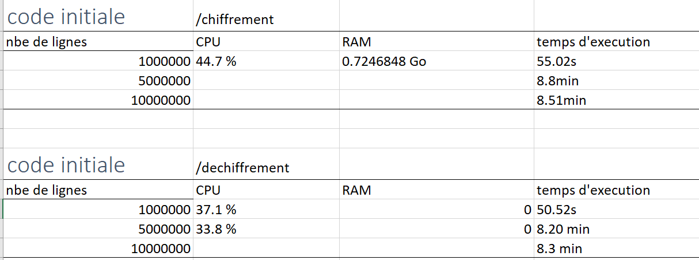

# projetD-anonymisation

# ANONYMISATION

### Ce projet a été créé pour l'entreprise INWI

### Installation:
télécharger le projet : https://github.com/Aichael29/projetD-anonymisation_Inwi.git.
1. Accédez au répertoire du projet via console : cd 'le chemin de projet téléchargé'.
2. Installez les dépendances du projet : pip install -r requirements.txt.
3. Cyptodome : pip install pycryptodomex.
4. pandas : pip install pandas.
5. openpyxl : pip install openpyxl.

### Utilisation
Ce projet permet de chiffrer, déchiffrer et hasher des fichiers Excel en utilisant l'algorithme AES. Vous pouvez l'utiliser en suivant ces étapes :

* Choisir votre fichier Excel à chiffrer ou déchiffrer ou hasher.
* Accéder au fichier de conf dans le projet téléchargé.
* Modifiez le fichier de configuration (nommé configuration.conf), qui contient les informations nécessaires pour effectuer l'opération de chiffrement ou de dechiffrement ou hashage .
* Suivez les instructions à l'écran pour chiffrer ou déchiffrer votre fichier.
* Lancez le script pour obtenir l'output : python main.py.

## CODE:
 
### Introduction

Le code fourni est un script Python permettant de chiffrer, déchiffrer, hasher ou anonymiser des fichiers CSV, JSON, XML et TXT. Le script utilise des bibliothèques Python telles que pandas, configparser, psutil et time pour effectuer les opérations.

### Description de l'architecture et des fonctionnalités

* Le script Python est divisé en plusieurs sections, chacune effectuant une tâche spécifique. Tout d'abord, les bibliothèques sont importées, suivies des fonctions nécessaires à la réalisation de chaque tâche. Les variables sont ensuite initialisées en fonction du fichier de configuration.

* Le script peut effectuer quatre opérations différentes : le chiffrement, le déchiffrement, le hachage et l'anonymisation. La première étape consiste à vérifier l'extension du fichier d'entrée, puis à exécuter la tâche appropriée en fonction de l'opération spécifiée dans le fichier de configuration.

* Pour les fichiers TXT, HTML et DOCX, chaque ligne est lue, puis l'opération appropriée est appliquée à chaque ligne. Les lignes modifiées sont ensuite écrites dans un nouveau fichier.

* Pour les fichiers CSV, un DataFrame pandas est créé à partir du fichier d'entrée. L'opération appropriée est appliquée à chaque colonne spécifiée dans le fichier de configuration. Les données modifiées sont ensuite écrites dans un nouveau fichier CSV.

* Pour les fichiers XML, un DataFrame pandas est créé à partir du fichier d'entrée en utilisant la fonction "read_xml" de pandas. L'opération appropriée est appliquée à chaque colonne spécifiée dans le fichier de configuration, puis le DataFrame modifié est écrit dans un nouveau fichier XML en utilisant la fonction "to_xml" de pandas.

* Pour les fichiers JSON, la fonction "load" est utilisée pour charger le fichier JSON en un DataFrame pandas. L'opération appropriée est ensuite appliquée à chaque colonne spécifiée dans le fichier de configuration. Les données modifiées sont ensuite écrites dans un nouveau fichier JSON en utilisant la fonction "dump" de python.

### Analyse des fonctionnalités de sécurité

* Le script implémente des fonctionnalités de sécurité telles que le chiffrement et le hachage pour protéger les données sensibles. Les clés de chiffrement et les vecteurs d'initialisation sont stockés dans le fichier de configuration, ce qui permet de les modifier facilement.

* La fonction d'anonymisation utilise la bibliothèque "annony" qui implémente l'algorithme de chiffrement AES-256 pour masquer les données sensibles. Cela peut aider à protéger la vie privée des utilisateurs en masquant les données personnelles.

* Le script utilise également la bibliothèque psutil pour mesurer l'utilisation de la mémoire et de la CPU avant et après l'exécution du code. Cela peut aider à détecter les fuites de mémoire et les problèmes de performances.

### Conclusion

Dans l'ensemble, le script Python fourni offre des fonctionnalités utiles pour protéger les données sensibles. Cependant, il peut être amélioré en ajoutant des fonctionnalités de validation et de vérification des entrées utilisateur. De plus, la documentation des fonctions est insuffisante, ce qui peut rendre difficile la compréhension et l'utilisation du code pour les développeurs qui ne sont pas familiers avec celui-ci.

### Test:
Information systeme :
*    Systéme d'exploitation : Windows 10 Professionnel 64 bits (10.0, build 19045)
*    Fabricant du systéme : HP
*    Modele du systéme : HP EliteBook 820 G3
*    Processeur : Intel(R) Core(TM) i5-6200 CPU @ 2.30GHz (4 CPUS), ~2.4GHz
*    Mémoire : 8192M8 RAM

